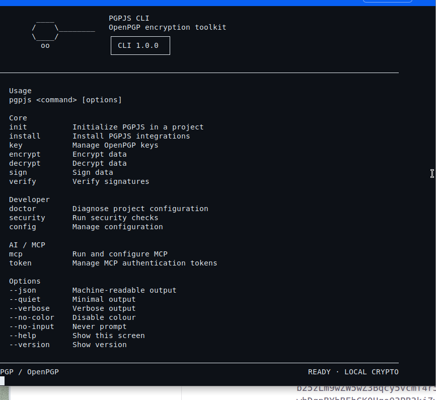
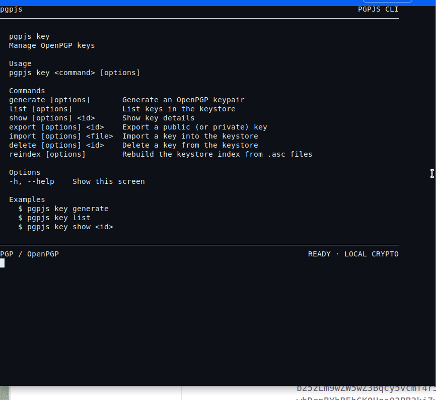

# PGPJS CLI on macOS

<p class="blog-kicker">Download · Apple</p>

This is the macOS download page for the PGPJS CLI — the same toolkit the homepage card **PGPJS on macOS** points at. There is no web UI. `pgpjs` is a command-line program you install with npm, then run from **Terminal** or iTerm.


## Install

1. Install [Node.js 20.10 or newer](https://nodejs.org/). Homebrew users can run `brew install node`.
2. Open **Terminal**.
3. Install the CLI globally:

```bash
npm install -g pgpjs-cli
```

<button type="button" class="install-copy" data-copy="npm install -g pgpjs-cli">Copy</button>

4. Confirm it is on your PATH:

```bash
pgpjs --help
node -v
```

That splash screen is the CLI from [pgpjs/cli](https://github.com/pgpjs/cli). Cryptography is OpenPGP.js (RFC 9580). The CLI does not invent algorithms, does not talk to the network, and does not ship telemetry.



## Initialize a project

```bash
cd my-app
pgpjs init
pgpjs doctor
```

Then, depending on the stack:

```bash
pgpjs install next
pgpjs install react
pgpjs install node
```

Keys, encrypt, and sign stay in the terminal:

```bash
pgpjs key --help
```



## Requirements

- Node.js **>= 20.10**
- macOS (Apple Silicon or Intel)
- npm (bundled with Node)

If `pgpjs` is not found after install, restart Terminal or use `npx pgpjs-cli`.

## Next

- [Windows install](windows.md)
- [CLI inside Prysel Robotics Studio](/prysel/cli/git)
- [All downloads](../overview.md)
- Source: [github.com/pgpjs/cli](https://github.com/pgpjs/cli)
