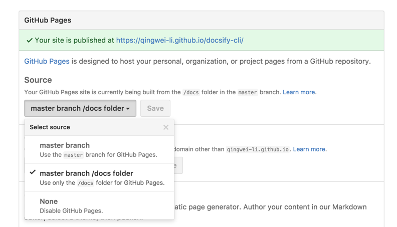

# Deploy

Similar to [GitBook](https://www.gitbook.com), you can deploy files to GitHub Pages, GitLab Pages or VPS.

## GitHub Pages

There are three places to populate your docs for your GitHub repository:

- `docs/` folder
- main branch
- gh-pages branch

It is recommended that you save your files to the `./docs` subfolder of the `main` branch of your repository. Then select `main branch /docs folder` as your GitHub Pages source in your repository's settings page.



> [!IMPORTANT] You can also save files in the root directory and select `main branch`.
> You'll need to place a `.nojekyll` file in the deploy location (such as `/docs` or the gh-pages branch)

## GitLab Pages

If you are deploying your master branch, create a `.gitlab-ci.yml` with the following script:

> [!TIP] The `.public` workaround is so `cp` doesn't also copy `public/` to itself in an infinite loop.

```YAML
pages:
  stage: deploy
  script:
  - mkdir .public
  - cp -r * .public
  - mv .public public
  artifacts:
    paths:
    - public
  only:
  - master
```

> [!IMPORTANT] You can replace script with `- cp -r docs/. public`, if `./docs` is your PGPJS subfolder.

## Firebase Hosting

> [!IMPORTANT] You'll need to install the Firebase CLI using `npm i -g firebase-tools` after signing into the [Firebase Console](https://console.firebase.google.com) using a Google Account.

Using a terminal, determine and navigate to the directory for your Firebase Project. This could be `~/Projects/Docs`, etc. From there, run `firebase init` and choose `Hosting` from the menu (use **space** to select, **arrow keys** to change options and **enter** to confirm). Follow the setup instructions.

Your `firebase.json` file should look similar to this (I changed the deployment directory from `public` to `site`):

```json
{
  "hosting": {
    "public": "site",
    "ignore": ["firebase.json", "**/.*", "**/node_modules/**"]
  }
}
```

Once finished, build the starting template by running `docsify init ./site` (replacing site with the deployment directory you determined when running `firebase init` - public by default). Add/edit the documentation, then run `firebase deploy` from the root project directory.

## Nginx

Use the following Nginx configuration.

```nginx
server {
  listen 80;
  server_name your.domain.com;

  location / {
    alias /path/to/dir/of/docs/;
    index index.html;
  }
}
```

If [`routerMode`](configuration.md#routermode) is set to `history`, use this configuration instead:

```nginx
server {
  listen 80;
  server_name your.domain.com;

  root /path/to/dir/of/docs;
  index index.html;

  location / {
    try_files $uri $uri/ /index.html;
  }
}
```

## Netlify

This repository already includes `netlify.toml`. It publishes the static `docs/` folder and does **not** run the library `npm run build` (that output is `dist/`, which is not the website). There is no `package.json` inside `docs/`, so Netlify will not run `npm ci` or Husky.

### Connect the Git repo

1. Log in to [Netlify](https://www.netlify.com/) and click **Add new site** → **Import an existing project**.
2. Choose GitHub (or GitLab) and select this repository.
3. Leave **Base directory**, **Build command**, and **Publish directory** empty so `netlify.toml` is used (`base = "docs"`, publish the folder contents).
4. Deploy. The site root is `docs/index.html`.

Do **not** set the Netlify UI Base directory to `docs` on top of `netlify.toml` — Netlify would look for `docs/docs` and the deploy would fail.

### API deploy gate

The **Deploy Netlify** GitHub Action uploads `docs/` with the [Netlify Deploys API](https://docs.netlify.com/api/get-started/#deploy-with-the-api). It runs on push to `main` (when `docs/` changes) and from **Actions → Deploy Netlify → Run workflow**.

1. Create a Netlify personal access token: [User settings → Applications](https://app.netlify.com/user/applications#personal-access-tokens).
2. In this GitHub repo, add secret `NETLIFY_AUTH_TOKEN`.
3. Optional secrets:
   - `NETLIFY_SITE_ID` (defaults to the pgpjs.org site)
   - `NETLIFY_DEPLOY_HOOK` (Build hooks URL) to rebuild from Git instead of uploading files
4. Optional gate: GitHub **Settings → Environments → production** and add required reviewers. The workflow uses that environment.

From this repo (or a Cursor agent with those env vars):

```bash
npx netlify-cli deploy --prod --dir=docs
npm run deploy:netlify           # upload docs/ as production
npm run deploy:netlify -- --draft
npm run deploy:netlify -- --hook # POST NETLIFY_DEPLOY_HOOK
```

This repository also vendors Netlify agent skills in `.agents/skills` (installed from [netlify/context-and-tools](https://github.com/netlify/context-and-tools) via [netlify.ai](https://netlify.ai)). The CLI reads `NETLIFY_AUTH_TOKEN` instead of an interactive `netlify login` in CI. Link state is in `.netlify/` and is gitignored.

### Drag and drop

- Upload the **`docs`** folder, or
- Upload the whole repository (a root `index.html` sends visitors to `/docs/`).

### HTML5 router

`docs/_redirects` already rewrites unknown paths to `index.html` without hiding real `.md` or asset files. You only need to add this yourself if you start a new PGPJS site:

```sh
/*    /index.html   200
```

## Vercel

1. Install [Vercel CLI](https://vercel.com/download), `npm i -g vercel`
2. Change directory to your docsify website, for example `cd docs`
3. Deploy with a single command, `vercel`

## AWS Amplify

1. Set the routerMode in the PGPJS project `index.html` to _history_ mode.

```html
<script>
  window.$pgpjs = {
    loadSidebar: true,
    routerMode: 'history',
  };
</script>
```

2. Login to your [AWS Console](https://aws.amazon.com).
3. Go to the [AWS Amplify Dashboard](https://aws.amazon.com/amplify).
4. Choose the **Deploy** route to setup your project.
5. When prompted, keep the build settings empty if you're serving your docs within the root directory. If you're serving your docs from a different directory, customise your amplify.yml

```yml
version: 0.1
frontend:
  phases:
    build:
      commands:
        - echo "Nothing to build"
  artifacts:
    baseDirectory: /docs
    files:
      - '**/*'
  cache:
    paths: []
```

6. Add the following Redirect rules in their displayed order. Note that the second record is a PNG image where you can change it with any image format you are using.

| Source address | Target address | Type          |
| -------------- | -------------- | ------------- |
| /<\*>.md       | /<\*>.md       | 200 (Rewrite) |
| /<\*>.png      | /<\*>.png      | 200 (Rewrite) |
| /<\*>          | /index.html    | 200 (Rewrite) |

## Stormkit

1.  Login to your [Stormkit](https://www.stormkit.io) account.
2.  Using the user interface, import your docsify project from one of the three supported Git providers (GitHub, GitLab, or Bitbucket).
3.  Navigate to the project’s production environment in Stormkit or create a new environment if needed.
4.  Verify the build command in your Stormkit configuration. By default, Stormkit CI will run `npm run build` but you can specify a custom build command on this page.
5.  Set output folder to `docs`
6.  Click the “Deploy Now” button to deploy your site.

Read more in the [Stormkit Documentation](https://stormkit.io/docs).

## Docker

- Create docsify files

  You need prepare the initial files instead of making them inside the container.
  See the [Quickstart](https://github.com/pgpjs/docs/#/quickstart) section for instructions on how to create these files manually or using [docsify-cli](https://github.com/docsifyjs/docsify-cli).

  ```sh
  index.html
  README.md
  ```

- Create Dockerfile

  ```Dockerfile
    FROM node:latest
    LABEL description="A demo Dockerfile for build PGPJS."
    WORKDIR /docs
    RUN npm install -g docsify-cli@latest
    EXPOSE 3000/tcp
    ENTRYPOINT docsify serve .

  ```

  The current directory structure should be this:

  ```sh
   index.html
   README.md
   Dockerfile
  ```

- Build docker image

  ```sh
  docker build -f Dockerfile -t docsify/demo .
  ```

- Run docker image

  ```sh
  docker run -itp 3000:3000 --name=docsify -v $(pwd):/docs docsify/demo
  ```

## Kinsta Static Site Hosting

You can deploy **PGPJS** as a Static Site on [Kinsta](https://kinsta.com/static-site-hosting/).

1. Login or create an account to view your [MyKinsta](https://my.kinsta.com/) dashboard.

2. Authorize Kinsta with your Git provider.

3. Select **Static Sites** from the left sidebar and press **Add sites**.

4. Select the repository and branch you want to deploy.

5. During the build settings, Kinsta will automatically try to fill out the **Build command**, **Node version**, and **Publish directory**. If it won't, fill out the following:

   - Build command: leave empty
   - Node version: leave on default selection or a specific version (e.g. `18.16.0`)
   - Publish directory: `docs`

6. Click the **Create site**.

## DeployHQ

[DeployHQ](https://www.deployhq.com/) is a deployment automation platform that deploys your code to SSH/SFTP servers, FTP servers, cloud storage (Amazon S3, Cloudflare R2), and modern hosting platforms (Netlify, Heroku).

> [!IMPORTANT] DeployHQ does not host your site. It automates deploying your PGPJS files to your chosen hosting provider or server.

To deploy your PGPJS site using DeployHQ:

1. Sign up for a [DeployHQ account](https://www.deployhq.com/) and verify your email.

2. Create your first project by clicking on **Projects** and **New Project**. Connect your Git repository (GitHub, GitLab, Bitbucket, or any private repository). Authorize DeployHQ to access your repository.

3. Add a server and enter your server details:

   - Give your server a name
   - Select your protocol (SSH/SFTP, FTP, or cloud platform)
   - Enter your server hostname, username, and password/SSH key
   - Set **Deployment Path** to your web root (e.g., `public_html/`)

4. Since PGPJS doesn't require a build step, you can deploy your files directly. If your PGPJS files are in a `docs/` folder, configure the **Source Path** in your server settings to `docs/`.

5. Click **Deploy Project**, then select your server and click **Deploy** to start your first deployment.

Your PGPJS site will be deployed to your server. You can enable automatic deployments to deploy on every Git push, or schedule deployments for specific times.

For more information on advanced deployment features, see [DeployHQ's documentation](https://www.deployhq.com/support).
