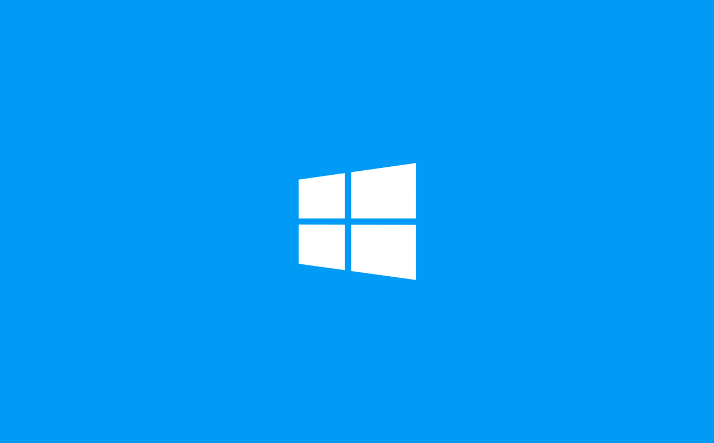
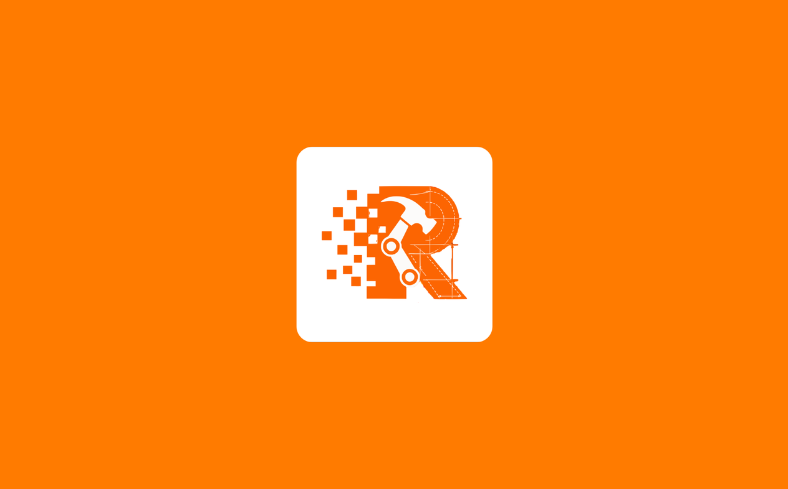

# Downloads

Install the PGPJS CLI and libraries. This page is the download hub — the homepage does not repeat these commands.

<section class="install-band" id="install">
  <div class="install-inner">
    <p class="install-kicker">Install PGPJS CLI</p>
    <h2>The terminal toolkit for OpenPGP.</h2>
    <div class="install-cmd">
      <code>npm install -g pgpjs-cli</code>
      <button
        type="button"
        class="install-copy"
        data-copy="npm install -g pgpjs-cli"
        title="Copy install command"
        aria-label="Copy npm install -g pgpjs-cli"
      >
        Copy
      </button>
    </div>
    <p class="install-lead">
      Paste that in a macOS Terminal, Linux shell, or Windows. Node.js 20.10 or
      newer. Then run <code>pgpjs</code> or <code>pgpjs --help</code>.
      <a href="https://github.com/pgpjs/cli" target="_blank" rel="noopener"
        >pgpjs/cli on GitHub</a
      >
    </p>
  </div>
</section>

## Packages

| Package | Install                    |
| ------- | -------------------------- |
| CLI     | `npm install -g pgpjs-cli` |
| Core    | `npm install @pgpjs/core`  |
| Next.js | `npm install @pgpjs/next`  |
| React   | `npm install @pgpjs/react` |
| MPC     | `npm install @pgpjs/mpc`   |

After the CLI is installed, run `pgpjs init` in a project. For multi-party computation, see [MPC](mpc/).

## Install on Windows

The homepage card **PGPJS on Windows** opens this path. Full walkthrough: [PGPJS CLI on Windows](cli/windows.md).



In **PowerShell**:

```powershell
npm install -g pgpjs-cli
pgpjs --help
```

<button type="button" class="install-copy" data-copy="npm install -g pgpjs-cli">Copy</button>

Node.js 20.10 or newer. Source: [pgpjs/cli](https://github.com/pgpjs/cli).

## Install on macOS

The homepage card **PGPJS on macOS** opens this path. Full walkthrough: [PGPJS CLI on macOS](cli/macos.md).


In **Terminal**:

```bash
npm install -g pgpjs-cli
pgpjs --help
```

<button type="button" class="install-copy" data-copy="npm install -g pgpjs-cli">Copy</button>

Node.js 20.10 or newer. Homebrew users can `brew install node` first.

## Install in Prysel Robotics Studio

The homepage card **PGPJS on Prysel Robotics Studio** is a blog: how the robotics workbench installs the same CLI and seals telemetry with PGPJS.

[Read the Prysel CLI story](prysel/cli/git.md)


